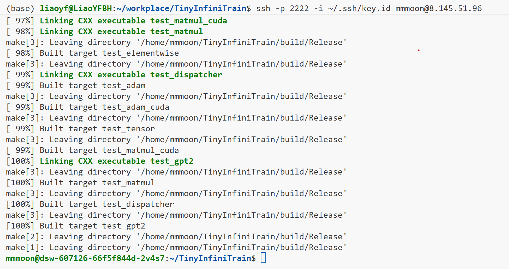
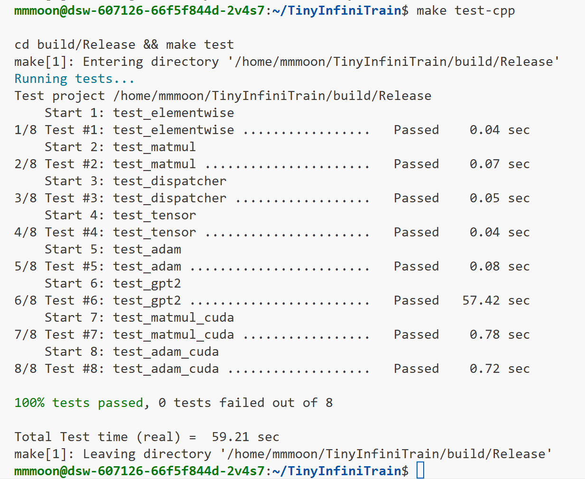
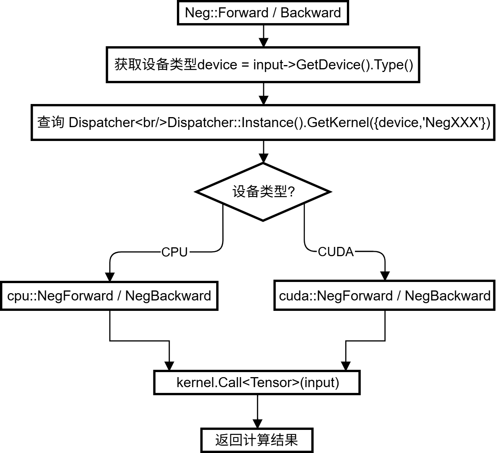
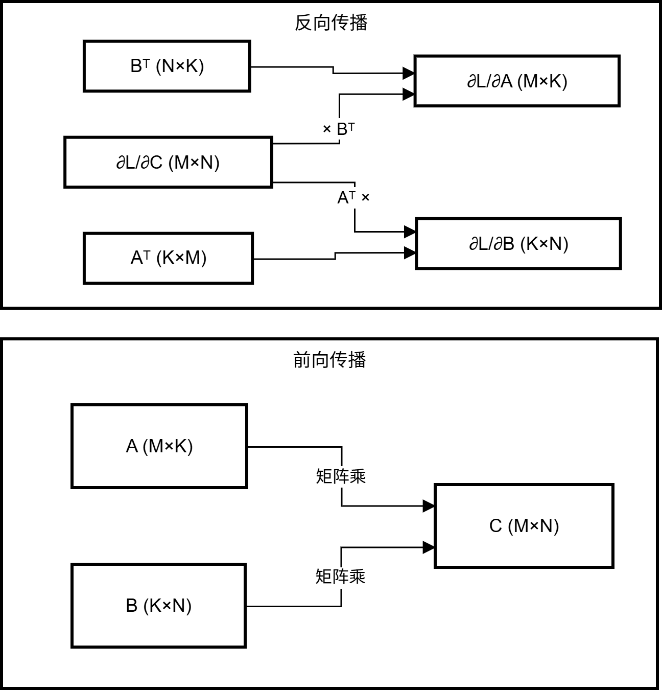
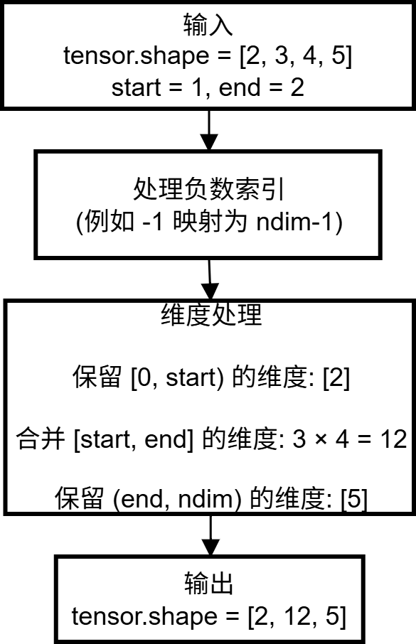
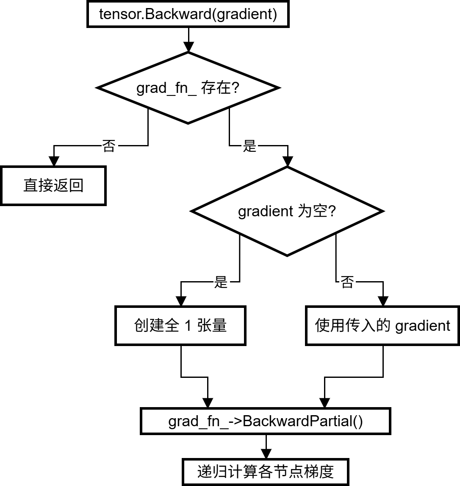
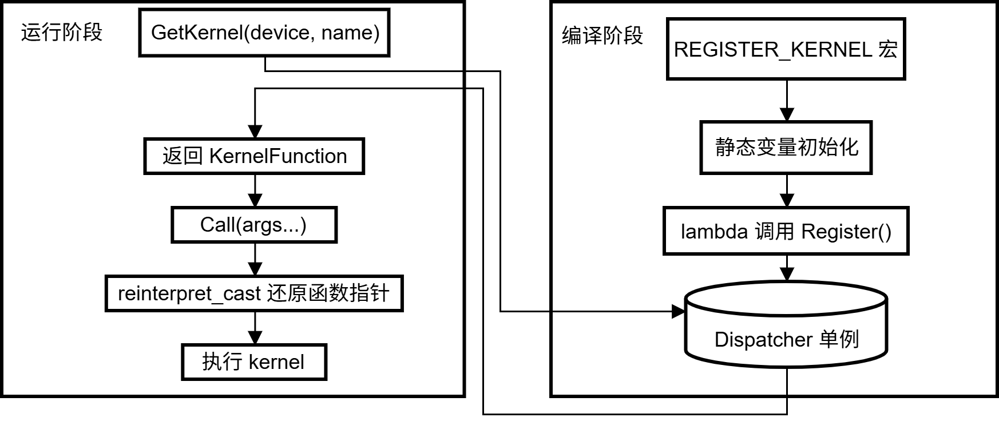
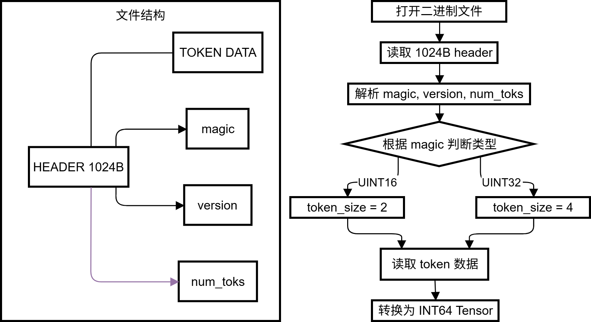

# TinyInfiniTrain 作业报告

## 一、编译成功和测试通过截图

算力：英伟达A100 * 8




## 二、作业实现

### 作业一：autograd机制调用Neg kernel的实现（⭐）

**文件位置**：`infini_train/src/autograd/elementwise.cc`

**调用流程**：

<div align="center">
  
</div>


**实现代码**：

```c++
namespace infini_train::autograd {
std::vector<std::shared_ptr<Tensor>> Neg::Forward(const std::vector<std::shared_ptr<Tensor>> &input_tensors) {
    // =================================== 作业 ===================================
    // TODO：通过Dispatcher获取设备专属kernel，对输入张量进行取反操作
    // NOTES: 依赖test_dispatcher，Neg kernel实现已给出
    // =================================== 作业 ===================================

    CHECK_EQ(input_tensors.size(), 1);
    const auto &input = input_tensors[0];

    auto device = input->GetDevice().Type();
    auto kernel = Dispatcher::Instance().GetKernel({device, "NegForward"});
    return {kernel.Call<std::shared_ptr<Tensor>>(input)};
}

std::vector<std::shared_ptr<Tensor>> Neg::Backward(const std::vector<std::shared_ptr<Tensor>> &grad_outputs) {
    // =================================== 作业 ===================================
    // TODO：通过Dispatcher获取设备专属的反向传播kernel，计算梯度
    // NOTES: 依赖test_dispatcher，Neg的kernel实现已给出
    // =================================== 作业 ===================================

    CHECK_EQ(grad_outputs.size(), 1);
    const auto &grad_output = grad_outputs[0];

    auto device = grad_output->GetDevice().Type();
    auto kernel = Dispatcher::Instance().GetKernel({device, "NegBackward"});
    return {kernel.Call<std::shared_ptr<Tensor>>(grad_output)};
}
```

这道题的核心是理解 TinyInfiniTrain 框架的算子调度机制。Neg 算子本身的数学逻辑很简单——对输入取反，反向传播时梯度也取反（因为 $\frac{\partial(-x)}{\partial x} = -1$）。关键在于如何通过 Dispatcher 获取正确的 kernel 实现。

整个调用链路是这样的：首先从输入 Tensor 获取其所在设备类型（CPU 或 CUDA，只测试了A100上的情况），然后以 `(device, "NegForward")` 为键查询 Dispatcher 单例，拿到对应设备的 kernel 函数，最后调用 `kernel.Call<>()` 执行实际计算。刚开始做这道题时我不太清楚 Dispatcher 的用法，后来读了 Reciprocal 等已实现算子的代码才搞明白这套模式。另外要注意 GetKernel 中的字符串必须和 REGISTER_KERNEL 注册时的名称完全一致，否则会找不到 kernel。


---

### 作业二：实现矩阵乘法（⭐⭐）

**计算流程**：

<div align="center">
  
</div>


#### CPU 实现

**文件位置**：`infini_train/src/kernels/cpu/linear.cc`

```c++
std::shared_ptr<Tensor> MatmulForward(const std::shared_ptr<Tensor> &input, const std::shared_ptr<Tensor> &other) {
    const auto &input_dims = input->Dims();
    const auto &other_dims = other->Dims();
    CHECK_GE(input_dims.size(), 2);
    CHECK_GE(other_dims.size(), 2);
    int64_t K = input_dims.back();
    CHECK_EQ(other_dims[other_dims.size() - 2], K);
    int64_t M = input_dims[input_dims.size() - 2];
    int64_t N = other_dims.back();

    auto output_dims = input_dims;
    output_dims.back() = N;
    auto output = std::make_shared<Tensor>(output_dims, DataType::kFLOAT32);

    int64_t batch_count = 1;
    for (size_t i = 0; i < input_dims.size() - 2; ++i) batch_count *= input_dims[i];

    bool other_is_2d = other_dims.size() == 2;
    if (!other_is_2d) {
        int64_t other_batch = 1;
        for (size_t i = 0; i < other_dims.size() - 2; ++i) other_batch *= other_dims[i];
        CHECK_EQ(batch_count, other_batch);
    }

    const float* in_ptr = static_cast<const float*>(input->DataPtr());
    const float* ot_ptr = static_cast<const float*>(other->DataPtr());
    float* out_ptr = static_cast<float*>(output->DataPtr());

    #pragma omp parallel for
    for (int64_t b = 0; b < batch_count; ++b) {
        Eigen::Map<const Eigen::Matrix<float, Eigen::Dynamic, Eigen::Dynamic, Eigen::RowMajor>> 
            mat_in(in_ptr + b * M * K, M, K);
        Eigen::Map<const Eigen::Matrix<float, Eigen::Dynamic, Eigen::Dynamic, Eigen::RowMajor>> 
            mat_ot(other_is_2d ? ot_ptr : ot_ptr + b * K * N, K, N);
        Eigen::Map<Eigen::Matrix<float, Eigen::Dynamic, Eigen::Dynamic, Eigen::RowMajor>> 
            mat_out(out_ptr + b * M * N, M, N);
        mat_out.noalias() = mat_in * mat_ot;
    }
    return output;
}

std::tuple<std::shared_ptr<Tensor>, std::shared_ptr<Tensor>>
MatmulBackward(const std::shared_ptr<Tensor> &input, const std::shared_ptr<Tensor> &other,
               const std::shared_ptr<Tensor> &grad_output) {
    const auto &input_dims = input->Dims();
    const auto &other_dims = other->Dims();
    int64_t K = input_dims.back();
    int64_t M = input_dims[input_dims.size() - 2];
    int64_t N = other_dims.back();

    auto grad_input = std::make_shared<Tensor>(input_dims, DataType::kFLOAT32);
    auto grad_other = std::make_shared<Tensor>(other_dims, DataType::kFLOAT32);
    grad_other->Fill(0.0f);

    int64_t batch_count = 1;
    for (size_t i = 0; i < input_dims.size() - 2; ++i) batch_count *= input_dims[i];
    bool other_is_2d = other_dims.size() == 2;

    const float* in_ptr = static_cast<const float*>(input->DataPtr());
    const float* ot_ptr = static_cast<const float*>(other->DataPtr());
    const float* grad_ptr = static_cast<const float*>(grad_output->DataPtr());
    float* d_in_ptr = static_cast<float*>(grad_input->DataPtr());
    float* d_ot_ptr = static_cast<float*>(grad_other->DataPtr());

    #pragma omp parallel for
    for (int64_t b = 0; b < batch_count; ++b) {
        Eigen::Map<const Eigen::Matrix<float, Eigen::Dynamic, Eigen::Dynamic, Eigen::RowMajor>>
            mat_ot(other_is_2d ? ot_ptr : ot_ptr + b * K * N, K, N);
        Eigen::Map<const Eigen::Matrix<float, Eigen::Dynamic, Eigen::Dynamic, Eigen::RowMajor>>
            mat_grad(grad_ptr + b * M * N, M, N);
        Eigen::Map<Eigen::Matrix<float, Eigen::Dynamic, Eigen::Dynamic, Eigen::RowMajor>>
            mat_d_in(d_in_ptr + b * M * K, M, K);
        mat_d_in.noalias() = mat_grad * mat_ot.transpose();
    }

    if (other_is_2d) {
        Eigen::Map<Eigen::Matrix<float, Eigen::Dynamic, Eigen::Dynamic, Eigen::RowMajor>>
            mat_d_ot(d_ot_ptr, K, N);
        for (int64_t b = 0; b < batch_count; ++b) {
            Eigen::Map<const Eigen::Matrix<float, Eigen::Dynamic, Eigen::Dynamic, Eigen::RowMajor>>
                mat_in(in_ptr + b * M * K, M, K);
            Eigen::Map<const Eigen::Matrix<float, Eigen::Dynamic, Eigen::Dynamic, Eigen::RowMajor>>
                mat_grad(grad_ptr + b * M * N, M, N);
            mat_d_ot.noalias() += mat_in.transpose() * mat_grad;
        }
    } else {
        #pragma omp parallel for
        for (int64_t b = 0; b < batch_count; ++b) {
            Eigen::Map<const Eigen::Matrix<float, Eigen::Dynamic, Eigen::Dynamic, Eigen::RowMajor>>
                mat_in(in_ptr + b * M * K, M, K);
            Eigen::Map<const Eigen::Matrix<float, Eigen::Dynamic, Eigen::Dynamic, Eigen::RowMajor>>
                mat_grad(grad_ptr + b * M * N, M, N);
            Eigen::Map<Eigen::Matrix<float, Eigen::Dynamic, Eigen::Dynamic, Eigen::RowMajor>>
                mat_d_ot(d_ot_ptr + b * K * N, K, N);
            mat_d_ot.noalias() = mat_in.transpose() * mat_grad;
        }
    }
    return {grad_input, grad_other};
}
```

CPU 版本使用 Eigen 库实现矩阵运算。这里有个技巧是用 `Eigen::Map` 直接将 Tensor 的原始数据指针映射为 Eigen 矩阵，避免了数据拷贝的开销。对于批量矩阵乘法，我用 OpenMP 的 `#pragma omp parallel for` 并行处理各个 batch。

反向传播的数学推导并不复杂：对于 $C = A \times B$，有 $\frac{\partial L}{\partial A} = \frac{\partial L}{\partial C} \times B^T$ 和 $\frac{\partial L}{\partial B} = A^T \times \frac{\partial L}{\partial C}$。但实现时有个容易忽略的细节：当 other 矩阵是 2D（所有 batch 共享同一权重）时，计算 `grad_other` 需要把各 batch 的梯度累加起来，而不是简单覆盖。我一开始漏掉了这个累加逻辑，导致测试一直过不了。

#### CUDA 实现

**文件位置**：`infini_train/src/kernels/cuda/linear.cu`

```c++
std::shared_ptr<Tensor> MatmulForward(const std::shared_ptr<Tensor> &input, const std::shared_ptr<Tensor> &other) {
    // ... 维度检查和输出张量创建 ...
    
    cublasHandle_t handle;
    CUBLAS_CHECK(cublasCreate(&handle));
    float alpha = 1.0f, beta = 0.0f;

    if (other_is_2d) {
        int64_t m_flat = batch_count * M;
        CUBLAS_CHECK(cublasSgemm(handle, CUBLAS_OP_N, CUBLAS_OP_N, 
             N, m_flat, K, &alpha, ot_ptr, N, in_ptr, K, &beta, out_ptr, N));
    } else {
        CUBLAS_CHECK(cublasSgemmStridedBatched(handle, CUBLAS_OP_N, CUBLAS_OP_N,
             N, M, K, &alpha, ot_ptr, N, K*N, in_ptr, K, M*K, &beta, out_ptr, N, M*N, batch_count));
    }
    CUBLAS_CHECK(cublasDestroy(handle));
    return output;
}

std::tuple<std::shared_ptr<Tensor>, std::shared_ptr<Tensor>>
MatmulBackward(const std::shared_ptr<Tensor> &input, const std::shared_ptr<Tensor> &other,
               const std::shared_ptr<Tensor> &grad_output) {
    // ... 维度处理 ...
    
    if (other_is_2d) {
        // dInput = dOutput * Other^T
        CUBLAS_CHECK(cublasSgemm(handle, CUBLAS_OP_T, CUBLAS_OP_N, K, m_flat, N, &alpha,
             ot_ptr, N, grad_ptr, N, &beta, d_in_ptr, K));
        // dOther = Input^T * dOutput
        CUBLAS_CHECK(cublasSgemm(handle, CUBLAS_OP_N, CUBLAS_OP_T, N, K, m_flat, &alpha,
             grad_ptr, N, in_ptr, K, &beta, d_ot_ptr, N));
    } else {
        // 使用 cublasSgemmStridedBatched 处理批量矩阵乘法
    }
    return {grad_input, grad_other};
}
```

CUDA 版本调用 cuBLAS 的 `cublasSgemm` 和 `cublasSgemmStridedBatched` 函数。这里最大的坑是 cuBLAS 默认按列主序（column-major）存储矩阵，而我们的 Tensor 是行主序（row-major）。刚开始我直接按行主序的思路设置参数，结果全是错的。后来查阅资料才理解，对于行主序存储的 $C = A \times B$，在 cuBLAS 看来实际上是 $C^T = B^T \times A^T$，所以调用时要把 A 和 B 的顺序对调，leading dimension 也要相应调整。

批量矩阵乘法用 `cublasSgemmStridedBatched`，它的 stride 参数表示相邻两个矩阵在内存中的间隔元素数。这个参数一开始也算错了好几次，每次都要仔细对照 M、K、N 的定义来算。

---

### 作业三：实现Adam 优化器（⭐）

**算法流程**：
| 阶段      | 输入 / 变量                             | 计算公式                                                                         | 说明                    |
| ------- | ----------------------------------- | ---------------------------------------------------------------------------- | --------------------- |
| 输入      | $g,\ \theta,\ m,\ v,\ \alpha,\ t$   | —                                                                            | 梯度、参数、一阶/二阶动量、学习率、时间步 |
| 一阶动量更新  | $m,\ g$                             | $m = \beta_1 \cdot m + (1-\beta_1)\cdot g$                                   | 一阶动量更新                |
| 二阶动量更新  | $v,\ g$                             | $v = \beta_2 \cdot v + (1-\beta_2)\cdot g^2$                                 | 二阶动量更新                |
| 偏差修正（m） | $m,\ t$                             | $\hat m = \dfrac{m}{1-\beta_1^t}$                                            | 一阶动量偏差修正              |
| 偏差修正（v） | $v,\ t$                             | $\hat v = \dfrac{v}{1-\beta_2^t}$                                            | 二阶动量偏差修正              |
| 参数更新    | $\theta,\ \hat m,\ \hat v,\ \alpha$ | $\theta = \theta - \alpha \cdot \dfrac{\hat m}{\sqrt{\hat v} + \varepsilon}$ | 参数更新                  |

#### CPU 实现

**文件位置**：`infini_train/src/kernels/cpu/accumulate_grad.cc`

```c++
void AdamAccumulateGrad(const std::shared_ptr<Tensor> &grad, const std::shared_ptr<Tensor> &param,
                        const std::shared_ptr<Tensor> &m, const std::shared_ptr<Tensor> &v, float learning_rate,
                        float beta1, float beta2, float eps, int64_t t) {
    int64_t num_elements = param->NumElements();
    float* grad_ptr = (float*)grad->DataPtr();
    float* param_ptr = (float*)param->DataPtr();
    float* m_ptr = (float*)m->DataPtr();
    float* v_ptr = (float*)v->DataPtr();

    #pragma omp parallel for
    for (int64_t i = 0; i < num_elements; ++i) {
        float g = grad_ptr[i];
        m_ptr[i] = beta1 * m_ptr[i] + (1 - beta1) * g;
        v_ptr[i] = beta2 * v_ptr[i] + (1 - beta2) * g * g;
        float m_hat = m_ptr[i] / (1 - std::pow(beta1, t));
        float v_hat = v_ptr[i] / (1 - std::pow(beta2, t));
        param_ptr[i] -= learning_rate * m_hat / (std::sqrt(v_hat) + eps);
    }
}
```

#### CUDA 实现

**文件位置**：`infini_train/src/kernels/cuda/accumulate_grad.cu`

```c++
__global__ void AdamKernel(const float *grad, float *param, float *m, float *v, float learning_rate,
                           float beta1, float beta2, float eps, float beta1_t, float beta2_t, size_t num_elements) {
    int idx = blockIdx.x * blockDim.x + threadIdx.x;
    if (idx < num_elements) {
        float g = grad[idx];
        float m_val = beta1 * m[idx] + (1.0f - beta1) * g;
        float v_val = beta2 * v[idx] + (1.0f - beta2) * g * g;
        m[idx] = m_val;
        v[idx] = v_val;
        float m_hat = m_val / (1.0f - beta1_t);
        float v_hat = v_val / (1.0f - beta2_t);
        param[idx] -= learning_rate * m_hat / (sqrtf(v_hat) + eps);
    }
}

void AdamAccumulateGrad(...) {
    float beta1_t = powf(beta1, t);
    float beta2_t = powf(beta2, t);
    AdamKernel<<<num_blocks, threads_per_block>>>(grad_ptr, param_ptr, m_ptr, v_ptr,
        learning_rate, beta1, beta2, eps, beta1_t, beta2_t, num_elements);
}
```

Adam 优化器的实现相对直接，基本就是把论文里的公式翻译成代码。核心步骤包括：更新一阶动量 m（梯度的指数移动平均）、更新二阶动量 v（梯度平方的指数移动平均）、对 m 和 v 做偏差修正、最后用修正后的值更新参数。

CPU 版本用 OpenMP 并行化元素级操作。CUDA 版本的一个小优化是在 Host 端预先计算好 $\beta_1^t$ 和 $\beta_2^t$，然后作为参数传给 kernel，这样每个线程就不用重复计算幂次了。

实现时要注意时间步 t 必须从 1 开始计数，如果 t=0 的话偏差修正公式的分母 $(1-\beta^t)$ 会变成 0，直接除零报错

---

### 作业四：实现Tensor 基础操作（⭐）

#### Flatten 操作

**处理流程**：

<div align="center">
  
</div>


**文件位置**：`infini_train/src/tensor.cc`

```c++
std::shared_ptr<Tensor> Tensor::Flatten(int64_t start, int64_t end) {
    int64_t ndim = dims_.size();
    if (start < 0) start += ndim;
    if (end < 0) end += ndim;
    
    CHECK(start >= 0 && start < ndim) << "Invalid start dim";
    CHECK(end >= 0 && end < ndim) << "Invalid end dim";
    CHECK(start <= end) << "start must be <= end";
    
    std::vector<int64_t> new_shape;
    for (int i = 0; i < start; ++i) new_shape.push_back(dims_[i]);
    
    int64_t flattened_dim = 1;
    for (int i = start; i <= end; ++i) flattened_dim *= dims_[i];
    new_shape.push_back(flattened_dim);
    
    for (int i = end + 1; i < ndim; ++i) new_shape.push_back(dims_[i]);
    
    return Contiguous()->View(new_shape);
}
```

Flatten 操作要把指定范围 `[start, end]` 内的维度合并成一个。比如形状为 `[2, 3, 4, 5]` 的张量，`Flatten(1, 2)` 后变成 `[2, 12, 5]`。实现时先处理负数索引（Python 风格，-1 表示最后一维），然后把范围内各维度的大小相乘得到合并后的维度，最后调用 `View` 改变形状。这里有个前置条件是张量必须内存连续，所以要先调 `Contiguous()`。

#### 实现反向传播机制

**流程**：

<div align="center">
  
</div>


```c++
void Tensor::Backward(std::shared_ptr<Tensor> gradient, bool retain_graph, bool create_graph) const {
    if (!grad_fn_) return;
    
    if (!gradient) {
        gradient = std::make_shared<Tensor>(dims_, dtype_, GetDevice());
        gradient->Fill(1.0f);
    }
    
    grad_fn_->BackwardPartial(gradient, output_idx_);
}
```

反向传播机制 `Backward` 的实现则是检查当前张量是否有 `grad_fn_`（即是否在计算图中），如果有就调用 `BackwardPartial` 递归计算梯度。若调用时没有传入初始梯度，就创建一个全 1 的张量作为起点

---

### 作业五：注册算子kernel的实现（⭐⭐⭐）

**注册与调用流程**：

<div align="center">
  
</div>

**文件位置**：`infini_train/include/dispatcher.h`

```c++
template <typename RetT, class... ArgsT> RetT Call(ArgsT... args) const {
    using FuncT = RetT (*)(ArgsT...);
    auto func = reinterpret_cast<FuncT>(func_ptr_);
    return func(std::forward<ArgsT>(args)...);
}

template <typename FuncT> void Register(const KeyT &key, FuncT &&kernel) {
    CHECK(!key_to_kernel_map_.contains(key)) << "Kernel already registered: " << key.second;
    key_to_kernel_map_.emplace(key, KernelFunction(std::forward<FuncT>(kernel)));
}

#define REGISTER_KERNEL(device, kernel_name, kernel_func)                                                              \
    static const bool _reg_##kernel_name = []() {                                                                      \
        infini_train::Dispatcher::Instance().Register({device, #kernel_name}, kernel_func);                            \
        return true;                                                                                                   \
    }();
```

这道题要实现一套通用的 kernel 注册和调用机制。设计思路是用类型擦除：注册时把任意类型的函数指针转成 `void*` 存入 map，调用时再通过模板参数把 `void*` 还原成正确的函数类型。

`REGISTER_KERNEL` 宏利用了 C++ 静态变量在 main 函数之前初始化的特性。宏展开后会生成一个静态 bool 变量，其初始化表达式是一个立即执行的 lambda，在 lambda 里调用 `Dispatcher::Instance().Register()` 完成注册。这样只要包含了定义 kernel 的源文件，对应的 kernel 就会自动注册到 Dispatcher 中，不需要在 main 里显式调用初始化代码。

宏定义里用 `##` 拼接 kernel_name 生成唯一的变量名（避免重复定义），用 `#` 把 kernel_name 转成字符串。写这个宏时踩了个坑：NVCC 编译器对多行宏的格式要求比 GCC 严格，续行符 `\` 后面不能有任何空白字符，否则会报 `"#" not expected here` 的错误

---

### 作业六：实现GPT-2整体训练（⭐⭐⭐⭐）

**数据加载流程**：

<div align="center">
  
</div>


#### 数据集读取

**文件位置**：`example/common/tiny_shakespeare_dataset.cc`

```c++
TinyShakespeareFile ReadTinyShakespeareFile(const std::string &path, size_t sequence_length) {
    std::ifstream file(path, std::ios::binary);
    CHECK(file.is_open()) << "Failed to open " << path;
    
    const size_t header_size = 1024;
    std::vector<uint8_t> header = ReadSeveralBytesFromIfstream(header_size, &file);
    
    int32_t magic = BytesToType<int32_t>(header, 0);
    int32_t version = BytesToType<int32_t>(header, 4);
    int32_t num_toks = BytesToType<int32_t>(header, 8);
    
    CHECK(kTypeMap.count(magic)) << "Unknown magic " << magic;
    TinyShakespeareType type = kTypeMap.at(magic);
    size_t token_size = kTypeToSize.at(type);
    
    size_t data_size = num_toks * token_size;
    std::vector<uint8_t> data = ReadSeveralBytesFromIfstream(data_size, &file);
    
    // 转换为 INT64 以兼容 embedding kernel
    int64_t rows = num_toks / sequence_length;
    std::vector<int64_t> dims = {rows, static_cast<int64_t>(sequence_length)};
    infini_train::Tensor tensor(dims, infini_train::DataType::kINT64);
    int64_t* tensor_ptr = static_cast<int64_t*>(tensor.DataPtr());
    
    if (type == TinyShakespeareType::kUINT16) {
        const uint16_t* src = reinterpret_cast<const uint16_t*>(data.data());
        for (size_t i = 0; i < rows * sequence_length; ++i)
            tensor_ptr[i] = static_cast<int64_t>(src[i]);
    }
    // ...
}
```

这道题要完成 GPT-2 训练所需的数据加载功能。TinyShakespeare 数据文件采用二进制格式，开头是 1024 字节的 header（包含 magic number、版本号、token 数量等元信息），后面紧跟 token 数据。根据 magic number 可以判断 token 的存储类型是 UINT16 还是 UINT32。

#### Tokenizer

**文件位置**：`example/common/tokenizer.cc`

```c++
Tokenizer::Tokenizer(const std::string &filepath) {
    std::ifstream file(filepath, std::ios::binary);
    CHECK(file.is_open()) << "Failed to open " << filepath;
    auto header = ReadSeveralBytesFromIfstream(1024, &file);
    magic_number_ = BytesToType<uint32_t>(header, 0);
    int32_t vocab_size = BytesToType<int32_t>(header, 8);
    eot_token_ = kEotMap.at(magic_number_);

    for (int i = 0; i < vocab_size; ++i) {
        uint8_t len_byte;
        file.read(reinterpret_cast<char*>(&len_byte), 1);
        std::string token_str(len_byte, '\0');
        file.read(&token_str[0], len_byte);
        token_table_.push_back(token_str);
    }
}

std::string Tokenizer::Decode(uint32_t token_id) const {
    if (token_id < token_table_.size()) return token_table_[token_id];
    return "";
}
```

```c++
void Tokenizer::GenerateText(infini_train::nn::Module &model, uint32_t batch_size, uint32_t sequence_length,
                             uint32_t text_length, Device device) const {
    std::vector<int64_t> dims;
    dims.assign({batch_size, sequence_length});
    // x_tensor (FLAGS_batch_size, FLAGS_sequence_length) eq:(4, 64)
    infini_train::Tensor x_tensor = infini_train::Tensor(dims, DataType::kINT64);
    int64_t *x_buff = static_cast<int64_t *>(x_tensor.DataPtr());
    for (int i = 0; i < batch_size * sequence_length; ++i) { x_buff[i] = eot_token_; }

    // Give some contexts: "The meaning of life is "
    auto prompt = kPromptMap.at(magic_number_);
    auto prompt_len = prompt.size();
    for (int i = 0; i < prompt_len; ++i) { x_buff[i] = prompt[i]; }
    std::cout << "The meaning of life is";

    auto x = std::make_shared<infini_train::Tensor>(x_tensor.To(device));
    uint64_t kRngState = kRngState;
    LOG(INFO) << "start generate text:";
    for (int t = prompt_len; t < text_length; t++) {
        /* ===================================== 作业 =====================================
        TODO：实现单步文本生成逻辑
        HINT：调用model.Forward推理获取logits，根据推理结果进行随机采样，调用Decode获取文本结果
        ===================================== 作业 ===================================== */
        
        // Forward pass
        auto logits_vec = model.Forward({x}); 
        auto logits = logits_vec[0]; // (batch, seq_len, vocab)
        
        // Extract next token logits (at seq_len t-1)
        auto next_token_logits = logits->Slice(1, t - 1, t, 1); // (batch, 1, vocab)
        
        // Copy to CPU for sampling
        auto cpu_logits = std::make_shared<infini_train::Tensor>(next_token_logits->To(infini_train::Device(infini_train::DeviceType::kCPU, 0)));
        float* logits_ptr = static_cast<float*>(cpu_logits->DataPtr());
        int64_t vocab_size = cpu_logits->Dims().back();
        
        // Softmax and Sample
        std::vector<float> probs(vocab_size);
        float max_logit = -1e9;
        for(int i=0; i<vocab_size; ++i) max_logit = std::max(max_logit, logits_ptr[i]);
        float sum = 0.0f;
        for(int i=0; i<vocab_size; ++i) {
            probs[i] = std::exp(logits_ptr[i] - max_logit);
            sum += probs[i];
        }
        for(int i=0; i<vocab_size; ++i) probs[i] /= sum;
        
        float coin = RandomF32(kRngState);
        int token = SampleMult(probs.data(), vocab_size, coin);
        
        // Output
        std::string text = Decode(token);
        std::cout << text << std::flush;
        
        // Update input
        x_buff[t] = token;
        auto new_x = x_tensor.To(device);
        x = std::make_shared<infini_train::Tensor>(new_x);
    }
    std::cout << std::endl;
}
} // namespace infini_train

```


Tokenizer 的二进制文件格式类似，也是 1024 字节 header 加词表数据。词表中每个 token 由 1 字节长度前缀加实际字符串组成，解析时逐个读取存入 `token_table_` 即可。

这道题最大的坑是数据类型不匹配。数据文件里的 token 是 UINT16（2 字节），但 embedding kernel 的实现要求输入必须是 INT64（8 字节），类型检查不过直接崩溃。而且 Dataset 的 `operator[]` 在计算偏移时用的是 `sizeof(int64_t)`，如果底层数据还是 UINT16 就会读错位置。解决方法是在 `ReadTinyShakespeareFile` 里把 UINT16 数据逐个转成 INT64 再存入 Tensor。

---

## 三、开发过程中遇到的问题

### 3.1 CUDA 环境变量未配置

在远程机器上首次编译时，CMake 报错无法检测 CUDA 架构：

```
-- The CUDA compiler identification is unknown
CMake Error at /usr/local/lib/python3.12/dist-packages/cmake/data/share/cmake-3.31/Modules/CMakeDetermineCUDACompiler.cmake:266 (message):
Failed to detect a default CUDA architecture.

Compiler output:

Call Stack (most recent call first):
CMakeLists.txt:44 (enable_language)

-- Configuring incomplete, errors occurred!
make: *** [Makefile:11: build] Error 1
```

这个问题的原因是远程机器的 CUDA 工具链路径没有加入环境变量，nvcc 编译器找不到。用下列命令行解决：

```bash
export PATH=/usr/local/cuda/bin:$PATH
export LD_LIBRARY_PATH=/usr/local/cuda/lib64:$LD_LIBRARY_PATH
```

### 3.2 文件上传到远程机器失败

开发过程中需要频繁将本地修改的代码同步到远程 GPU 机器，但直接使用 scp 命令总是失败。后来改用 rsync 或者 SSH + cat 的方式解决了这个问题：

```bash
# 使用 rsync
rsync -avz -e "ssh -p 2222 -i ~/.ssh/key.id" /home/liaoyf/workplace/TinyInfiniTrain/example/common/tiny_shakespeare_dataset.cc mmmoon@8.145.51.96:~/TinyInfiniTrain/example/common/

# 或者使用 SSH + cat
cat /home/liaoyf/workplace/TinyInfiniTrain/infini_train/src/kernels/cuda/linear.cu | ssh -p 2222 -i ~/.ssh/key.id mmmoon@8.145.51.96 "cat > ~/TinyInfiniTrain/infini_train/src/kernels/cuda/linear.cu"
```

### 3.3 CUDA 矩阵乘法反向传播测试失败

完成 CUDA 版本的 Matmul 实现后，运行测试发现 `BackwardPassCuda` 失败，`grad_other` 的计算结果与期望值不一致：

```
mmmoon@dsw-607126-66f5f844d-2v4s7:~/TinyInfiniTrain$ cd build/Release && ctest --rerun-failed --output-on-failure
Test project /home/mmmoon/TinyInfiniTrain/build/Release
Start 6: test_gpt2
1/2 Test #6: test_gpt2 ........................Subprocess aborted***Exception: 48.94 sec
...
2/2 Test #7: test_matmul_cuda .................***Failed 0.80 sec
Running main() from /home/mmmoon/TinyInfiniTrain/third_party/googletest/googletest/src/gtest_main.cc
[==========] Running 3 tests from 1 test suite.
[----------] 3 tests from MatmulTest
[ RUN ] MatmulTest.BasicMatrixMultiplyCuda
[ OK ] MatmulTest.BasicMatrixMultiplyCuda (590 ms)
[ RUN ] MatmulTest.BatchedMatrixMultiplyCuda
[ OK ] MatmulTest.BatchedMatrixMultiplyCuda (3 ms)
[ RUN ] MatmulTest.BackwardPassCuda
/home/mmmoon/TinyInfiniTrain/test/kernels/test_matmul_cuda.cc:153: Failure
Expected equality of these values:
  static_cast<float*>(grad_other.DataPtr())[i]
    Which is: 0.5
  expected_grad_other[i]
    Which is: 1.3
...
[ FAILED ] MatmulTest.BackwardPassCuda (10 ms)
```

分析测试用例发现，当 other 矩阵是 2D（即所有 batch 共享同一权重矩阵）时，反向传播计算 `grad_other` 需要将所有 batch 的梯度累加起来，而不是只计算最后一个 batch 的梯度。修正后在 2D 情况下使用 `cublasSgemm` 将所有 batch 展平成一个大矩阵进行计算，这样自然就完成了梯度累加。

### 3.4 Embedding Kernel 数据类型检查失败

GPT-2 测试运行时直接崩溃，报错信息显示 embedding kernel 的输入类型检查失败：

```
I20260202 17:51:08.681154 140267979141120 test_gpt2.cc:123] Initialize() finished!
I20260202 17:51:08.681198 140267979141120 test_gpt2.cc:207] epoch: 0
F20260202 17:51:08.684022 140267979141120 embedding.cu:34] Check failed: input->Dtype() == DataType::kINT64
```

排查发现问题出在数据集读取逻辑上。TinyShakespeare 数据文件中的 token 是以 UINT16（2 字节）格式存储的，而 embedding kernel 要求输入必须是 INT64（8 字节）类型。更麻烦的是，在 `operator[]` 中计算 y 偏移时使用的是 `sizeof(int64_t)`，这导致读取位置错位。解决方案是在 `ReadTinyShakespeareFile` 函数中，读取 UINT16 数据后立即转换为 INT64 类型存储到 Tensor 中，这样既满足了 embedding kernel 的类型要求，也保证了后续索引计算的正确性。

### 3.5 NVCC 编译器宏展开报错

编写 `REGISTER_KERNEL` 宏后，GCC 编译正常，但 NVCC 编译 CUDA 文件时报错：

```
/home/mmmoon/TinyInfiniTrain/infini_train/include/dispatcher.h(65): error: "#" not expected here
      static const bool _reg_##kernel_name = []() {
                             ^
```

这个问题困扰了一段时间。NVCC 对宏定义中的 `##`（token 拼接）和 `#`（字符串化）操作符的处理比 GCC 更严格。最终发现是多行宏定义的续行符 `\` 后面多了空格或制表符，导致 NVCC 无法正确解析。清理掉续行符后面的空白字符后编译通过。这个经验提醒我，写跨编译器的宏定义时要格外注意格式细节。

